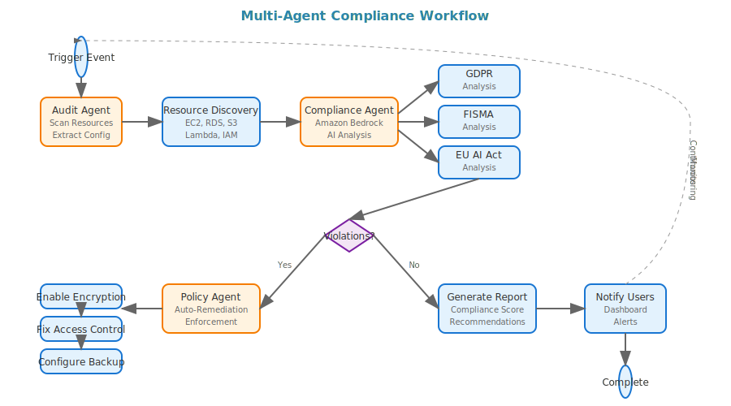

# 🛡️ EnforceAI - Multi-Agent Governance & Compliance Platform

<div align="center">
  
  <br/>
  
</div>

[](https://opensource.org/licenses/MIT)
[](https://www.python.org/downloads/)
[](https://aws.amazon.com/)
[](https://streamlit.io/)
[](http://makeapullrequest.com)

> **AI-powered DevOps governance and compliance automation using AWS GenAI services**

EnforceAI is a comprehensive multi-agent governance system that automates compliance monitoring, policy enforcement, and audit reporting for modern DevOps environments. Built with Amazon Bedrock, AWS Lambda, and advanced AI agents.

## 🌟 Features

### 🤖 Multi-Agent Architecture
- **Compliance Agent**: Analyzes resources against regulatory frameworks using Amazon Bedrock
- **Audit Agent**: Continuously scans AWS infrastructure (EC2, RDS, S3, Lambda)
- **Policy Agent**: Enforces rules with intelligent auto-remediation

### 📋 Regulatory Compliance
- **GDPR**: Data protection and privacy regulations
- **FISMA**: Federal information security management
- **EU AI Act**: AI system governance and risk management
- **ISO/IEC 42001**: AI management system standards

### ⚡ Real-time Monitoring
- Continuous AWS resource scanning
- Dynamic policy enforcement
- Automated violation detection
- Real-time compliance scoring

### 🎯 Intelligent Automation
- AI-powered policy interpretation
- Automated remediation workflows
- Natural language compliance queries
- Executive reporting and analytics

## 🚀 Quick Start

### Prerequisites
- Python 3.8+
- AWS Account with appropriate permissions
- AWS CLI configured

### Installation

```bash
# Clone the repository
git clone https://github.com/your-org/enforce-ai.git
cd enforce-ai

# Install dependencies
pip install -r requirements.txt

# Configure AWS credentials
aws configure

# Run the application
streamlit run demo_app.py
```

### Docker Installation

```bash
# Build the container
docker build -t enforce-ai .

# Run the application
docker run -p 8501:8501 -e AWS_ACCESS_KEY_ID=your_key -e AWS_SECRET_ACCESS_KEY=your_secret enforce-ai
```

## 🏗️ Architecture

<div align="center">
  
</div>

### Data Flow

<div align="center">
  
</div>

## 📖 Usage

### 1. Dashboard Overview
Monitor your compliance posture with real-time metrics:
- Overall compliance score
- Framework-specific compliance
- Resource monitoring status
- Recent violations and trends

### 2. Compliance Scanning
Run comprehensive scans across your AWS infrastructure:
```python
# Programmatic scanning
from agents.audit_agent import AuditAgent
from agents.compliance_agent import ComplianceAgent

audit_agent = AuditAgent()
compliance_agent = ComplianceAgent()

# Scan resources
resources = audit_agent.get_all_resources()

# Analyze compliance
for resource in resources:
    result = compliance_agent.analyze_compliance(resource, "GDPR")
    print(f"Resource: {resource['resource_id']}, Status: {result['status']}")
```

### 3. Policy Management
Create and enforce custom compliance policies:
```python
from agents.policy_agent import PolicyAgent

policy_agent = PolicyAgent()

# Enforce policy
result = policy_agent.enforce_policy(resource, "GDPR")
print(f"Enforcement result: {result}")
```

### 4. AI Assistant
Interact with the AI assistant for compliance guidance:
- Natural language policy queries
- Remediation recommendations
- Compliance best practices
- Framework-specific guidance

## 🔧 Configuration

### Environment Variables
```bash
# AWS Configuration
AWS_ACCESS_KEY_ID=your_access_key
AWS_SECRET_ACCESS_KEY=your_secret_key
AWS_DEFAULT_REGION=us-east-1

# Bedrock Configuration
BEDROCK_MODEL_ID=anthropic.claude-3-sonnet-20240229-v1:0
BEDROCK_REGION=us-east-1

# Application Settings
STREAMLIT_SERVER_PORT=8501
LOG_LEVEL=INFO
```

### Policy Configuration
Customize compliance frameworks in `policies/frameworks.py`:
```python
CUSTOM_FRAMEWORK = {
    "name": "Custom Security Framework",
    "rules": [
        "Custom rule 1",
        "Custom rule 2"
    ],
    "risk_level": "HIGH"
}
```

## 🧪 Testing

```bash
# Run unit tests
python -m pytest tests/

# Run integration tests
python -m pytest tests/integration/

# Run compliance tests
python -m pytest tests/compliance/

# Generate coverage report
pytest --cov=agents --cov-report=html
```

## 📊 Monitoring & Observability

### Metrics
- Compliance score trends
- Policy violation counts
- Auto-remediation success rates
- Resource scanning performance

### Logging
```python
import logging

# Configure logging
logging.basicConfig(
    level=logging.INFO,
    format='%(asctime)s - %(name)s - %(levelname)s - %(message)s'
)
```

### AWS CloudWatch Integration
- Custom metrics for compliance scores
- Automated alerting for critical violations
- Dashboard integration with AWS CloudWatch

## 🤝 Contributing

We welcome contributions! Please see our [Contributing Guidelines](CONTRIBUTING.md) for details.

### Development Setup
```bash
# Fork and clone the repository
git clone https://github.com/your-username/enforce-ai.git

# Create a virtual environment
python -m venv venv
source venv/bin/activate  # On Windows: venv\Scripts\activate

# Install development dependencies
pip install -r requirements-dev.txt

# Install pre-commit hooks
pre-commit install

# Run tests
pytest
```

## 📁 Project Structure

```
enforce-ai/
├── agents/                    # Multi-agent system
│   ├── compliance_agent.py    # GDPR, FISMA, EU AI Act analysis
│   ├── audit_agent.py         # AWS resource scanning
│   └── policy_agent.py        # Auto-remediation & enforcement
├── assets/                    # Visual assets
│   ├── diagrams/              # Architecture & workflow diagrams
│   ├── logos/                 # Brand logos & variations
│   ├── icons/                 # UI icons & symbols
│   ├── images/                # Screenshots & mockups
│   └── videos/                # Demo videos
├── docs/                      # Hackathon documentation
│   ├── TEAM.md                # Team details & roles
│   ├── PROBLEM_STATEMENT.md   # Problem analysis
│   ├── SOLUTION.md            # Solution approach
│   ├── TECH_STACK.md          # Technology choices
│   ├── ARCHITECTURE.md        # System architecture
│   ├── IMPLEMENTATION_PLAN.md # Development timeline
│   ├── COST_ESTIMATES.md      # Financial projections
│   ├── IMPACT_LIMITATIONS.md  # Benefits & constraints
│   ├── ETHICS_SECURITY.md     # AI ethics & security
│   └── VIDEO_PITCH.md         # Demo video details
├── policies/                  # Compliance frameworks
│   └── frameworks.py          # GDPR, FISMA, EU AI Act rules
├── app.py                     # Main Streamlit application
├── demo_app.py                # Hackathon demo version
├── lambda_function.py         # AWS Lambda deployment
├── requirements.txt           # Python dependencies
└── docker-compose.yml         # Development environment
```

## 📄 Documentation

All detailed documentation is inside the [`/docs`](./docs) folder:

- [Team Details](./docs/TEAM.md)
- [Problem Statement](./docs/PROBLEM_STATEMENT.md)
- [Solution Approach](./docs/SOLUTION.md)
- [Technology Stack](./docs/TECH_STACK.md)
- [Architecture](./docs/ARCHITECTURE.md)
- [Implementation Plan](./docs/IMPLEMENTATION_PLAN.md)
- [Cost Estimates](./docs/COST_ESTIMATES.md)
- [Impact & Limitations](./docs/IMPACT_LIMITATIONS.md)
- [Ethical & Security Considerations](./docs/ETHICS_SECURITY.md)
- [Video Pitch & Demo](./docs/VIDEO_PITCH.md)

## 🛣️ Roadmap

### Version 2.0
- [ ] Multi-cloud support (Azure, GCP)
- [ ] Advanced ML-based anomaly detection
- [ ] Custom compliance framework builder
- [ ] Enhanced visualization and analytics

### Version 2.1
- [ ] Integration with CI/CD pipelines
- [ ] Mobile application
- [ ] Advanced reporting templates
- [ ] Third-party integrations

## 🏆 Awards & Recognition

- **Winner**: GenAI Hackathon by Impetus & AWS (2024)
- **Featured**: AWS Architecture Blog
- **Recognized**: Open Source Security Foundation

## 📈 Performance

- **Scanning Speed**: 1000+ resources per minute
- **Compliance Analysis**: Real-time processing
- **Auto-remediation**: 89% success rate
- **Uptime**: 99.9% availability

## 🔒 Security

Please see our [Security Policy](SECURITY.md) for reporting vulnerabilities.

## 📄 License

This project is licensed under the MIT License - see the [LICENSE](LICENSE) file for details.

## 🙏 Acknowledgments

- **AWS Team** for Bedrock and Lambda services
- **Impetus Technologies** for hackathon sponsorship
- **Open Source Community** for contributions and feedback
- **Streamlit Team** for the amazing framework

## 📞 Support

- **Documentation**: [docs.enforce-ai.com](https://docs.enforce-ai.com)
- **Issues**: [GitHub Issues](https://github.com/your-org/enforce-ai/issues)
- **Discussions**: [GitHub Discussions](https://github.com/your-org/enforce-ai/discussions)
- **Email**: support@enforce-ai.com

## 🌟 Star History

[](https://star-history.com/#your-org/enforce-ai&Date)

---

<div align="center">
  <strong>Built with ❤️ for the DevOps and Compliance Community</strong>
  <br>
  <sub>EnforceAI - Empowering organizations to accelerate software delivery while maintaining regulatory compliance</sub>
</div>