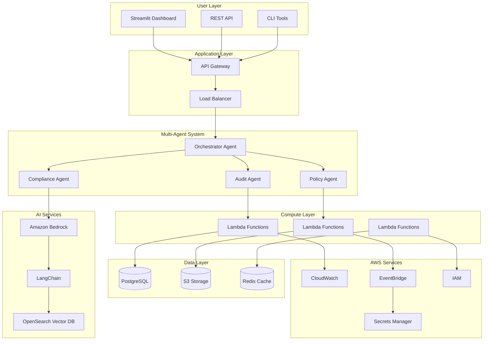
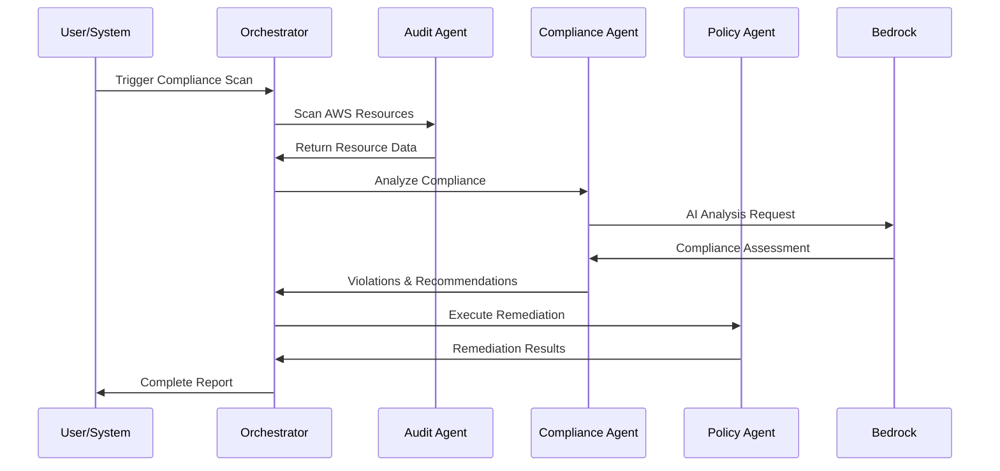
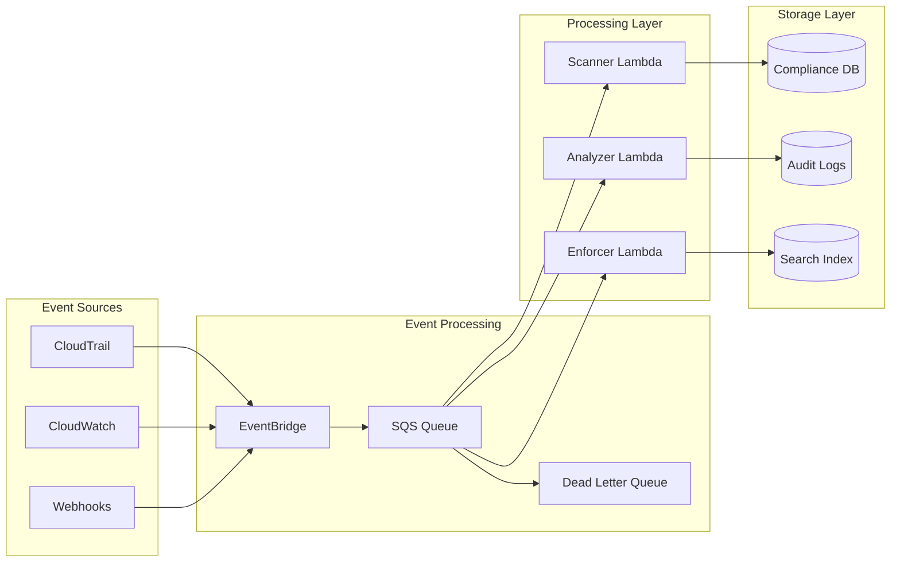
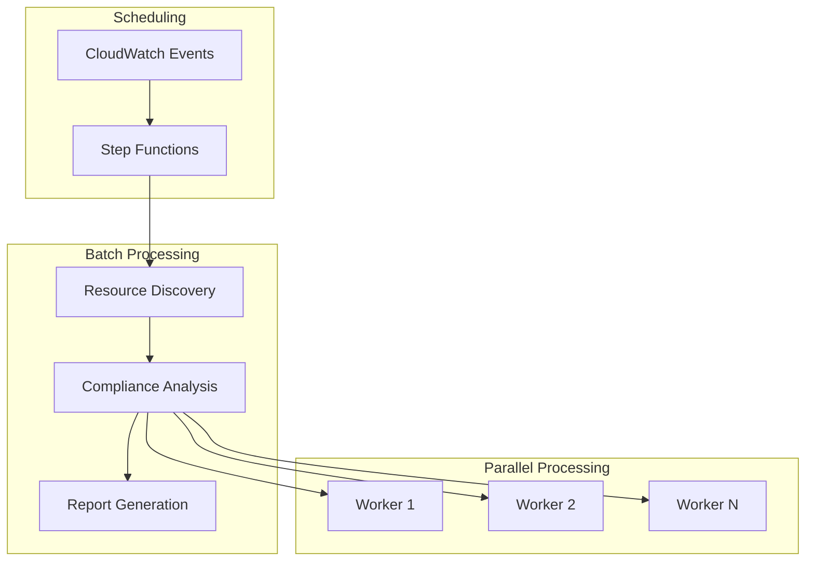
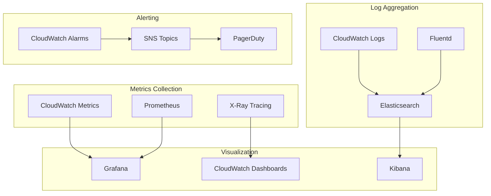

# 🏗️ System Architecture

## 🎯 Architecture Overview

EnforceAI implements a **cloud-native, event-driven, multi-agent architecture** that leverages AWS GenAI services to provide intelligent, scalable compliance governance.

### Design Principles
- **AI-First**: Amazon Bedrock powers intelligent decision making
- **Event-Driven**: Real-time processing with AWS EventBridge
- **Serverless**: AWS Lambda for elastic compute
- **Microservices**: Loosely coupled, independently deployable components
- **Security by Design**: Zero-trust architecture with encryption everywhere

## 🏛️ High-Level Architecture



## 🤖 Multi-Agent Architecture Detail

### Agent Orchestration Pattern



### Agent Specifications

#### 1. Orchestrator Agent
**Role**: Central coordinator and workflow manager

```python
class OrchestratorAgent:
    def __init__(self):
        self.audit_agent = AuditAgent()
        self.compliance_agent = ComplianceAgent()
        self.policy_agent = PolicyAgent()
    
    async def execute_compliance_workflow(self, request):
        # 1. Resource Discovery
        resources = await self.audit_agent.scan_resources(request.scope)
        
        # 2. Compliance Analysis
        analysis = await self.compliance_agent.analyze_batch(
            resources, request.frameworks
        )
        
        # 3. Policy Enforcement
        if request.auto_remediate:
            remediation = await self.policy_agent.remediate_violations(
                analysis.violations
            )
        
        # 4. Report Generation
        return ComplianceReport(
            resources=resources,
            analysis=analysis,
            remediation=remediation
        )
```

#### 2. Audit Agent
**Role**: AWS resource discovery and configuration analysis

**Capabilities**:
- Multi-service resource scanning
- Configuration drift detection
- Change event processing
- Evidence collection

```python
class AuditAgent:
    def __init__(self):
        self.aws_clients = self._initialize_aws_clients()
        self.scanners = {
            'ec2': EC2Scanner(),
            'rds': RDSScanner(),
            's3': S3Scanner(),
            'lambda': LambdaScanner(),
            'iam': IAMScanner()
        }
    
    async def scan_resources(self, scope: ScanScope) -> List[Resource]:
        tasks = []
        for service in scope.services:
            if service in self.scanners:
                tasks.append(self.scanners[service].scan(scope.regions))
        
        results = await asyncio.gather(*tasks)
        return self._merge_results(results)
```

#### 3. Compliance Agent
**Role**: AI-powered compliance analysis using Amazon Bedrock

**AI Models Used**:
- **Claude 3 Sonnet**: Complex compliance reasoning
- **Claude 3 Haiku**: Fast policy checks
- **Titan Text**: Document analysis

```python
class ComplianceAgent:
    def __init__(self):
        self.bedrock = boto3.client('bedrock-runtime')
        self.model_config = {
            'primary': 'anthropic.claude-3-sonnet-20240229-v1:0',
            'fast': 'anthropic.claude-3-haiku-20240307-v1:0'
        }
    
    async def analyze_compliance(self, resource: Resource, framework: str):
        prompt = self._build_compliance_prompt(resource, framework)
        
        response = await self.bedrock.invoke_model_async(
            modelId=self.model_config['primary'],
            body=json.dumps({
                "anthropic_version": "bedrock-2023-05-31",
                "max_tokens": 2000,
                "messages": [{"role": "user", "content": prompt}]
            })
        )
        
        return self._parse_compliance_response(response)
```

#### 4. Policy Agent
**Role**: Automated policy enforcement and remediation

**Remediation Strategies**:
- **Immediate**: Fix simple violations automatically
- **Scheduled**: Queue complex changes for maintenance windows
- **Manual**: Create tickets for human intervention
- **Compensating**: Apply alternative controls

```python
class PolicyAgent:
    def __init__(self):
        self.remediators = {
            'encryption': EncryptionRemediator(),
            'access_control': AccessControlRemediator(),
            'backup': BackupRemediator(),
            'monitoring': MonitoringRemediator()
        }
    
    async def remediate_violation(self, violation: Violation):
        remediator = self.remediators.get(violation.category)
        if remediator and violation.auto_remediable:
            return await remediator.fix(violation)
        else:
            return await self._create_manual_task(violation)
```

## 🔄 Data Flow Architecture

### Real-Time Processing Pipeline



### Batch Processing Architecture



## 🗄️ Data Architecture

### Database Schema Design

```sql
-- Core compliance tables
CREATE TABLE compliance_scans (
    id UUID PRIMARY KEY,
    organization_id UUID NOT NULL,
    scan_type VARCHAR(50) NOT NULL,
    frameworks TEXT[] NOT NULL,
    status VARCHAR(20) NOT NULL,
    started_at TIMESTAMP NOT NULL,
    completed_at TIMESTAMP,
    resource_count INTEGER,
    violation_count INTEGER,
    compliance_score DECIMAL(5,2),
    metadata JSONB
);

CREATE TABLE resources (
    id UUID PRIMARY KEY,
    scan_id UUID REFERENCES compliance_scans(id),
    aws_resource_id VARCHAR(255) NOT NULL,
    resource_type VARCHAR(100) NOT NULL,
    region VARCHAR(50) NOT NULL,
    configuration JSONB NOT NULL,
    tags JSONB,
    created_at TIMESTAMP NOT NULL,
    updated_at TIMESTAMP NOT NULL
);

CREATE TABLE violations (
    id UUID PRIMARY KEY,
    resource_id UUID REFERENCES resources(id),
    framework VARCHAR(50) NOT NULL,
    rule_id VARCHAR(100) NOT NULL,
    severity VARCHAR(20) NOT NULL,
    status VARCHAR(20) NOT NULL,
    description TEXT NOT NULL,
    remediation_steps TEXT[],
    auto_remediable BOOLEAN DEFAULT FALSE,
    detected_at TIMESTAMP NOT NULL,
    resolved_at TIMESTAMP
);

CREATE TABLE remediation_actions (
    id UUID PRIMARY KEY,
    violation_id UUID REFERENCES violations(id),
    action_type VARCHAR(50) NOT NULL,
    status VARCHAR(20) NOT NULL,
    executed_by VARCHAR(100),
    executed_at TIMESTAMP,
    result JSONB,
    error_message TEXT
);
```

### Caching Strategy

```python
# Multi-layer caching architecture
class CacheManager:
    def __init__(self):
        self.redis = redis.Redis(host='elasticache-endpoint')
        self.local_cache = {}
    
    async def get_compliance_result(self, resource_id: str, framework: str):
        # L1: Local cache (in-memory)
        cache_key = f"{resource_id}:{framework}"
        if cache_key in self.local_cache:
            return self.local_cache[cache_key]
        
        # L2: Redis cache (distributed)
        cached = await self.redis.get(cache_key)
        if cached:
            result = json.loads(cached)
            self.local_cache[cache_key] = result
            return result
        
        # L3: Database (persistent)
        return await self._fetch_from_database(resource_id, framework)
```

## 🔒 Security Architecture

### Zero-Trust Security Model

```mermaid
graph TB
    subgraph "Identity & Access"
        IAM[AWS IAM]
        COG[Cognito]
        MFA[Multi-Factor Auth]
    end
    
    subgraph "Network Security"
        VPC[Private VPC]
        SG[Security Groups]
        NACL[Network ACLs]
        WAF[Web Application Firewall]
    end
    
    subgraph "Data Protection"
        KMS[AWS KMS]
        SM[Secrets Manager]
        SSL[TLS 1.3]
    end
    
    subgraph "Monitoring"
        CT[CloudTrail]
        GD[GuardDuty]
        SEC[Security Hub]
    end
    
    IAM --> COG
    COG --> MFA
    
    VPC --> SG
    SG --> NACL
    NACL --> WAF
    
    KMS --> SM
    SM --> SSL
    
    CT --> GD
    GD --> SEC
```



### Encryption Strategy

```yaml
Encryption at Rest:
  - RDS: AES-256 with AWS KMS
  - S3: SSE-S3 and SSE-KMS
  - EBS: Encrypted volumes
  - Lambda: Environment variables encrypted

Encryption in Transit:
  - API Gateway: TLS 1.3
  - Application: HTTPS everywhere
  - Database: SSL/TLS connections
  - Internal: VPC endpoints with encryption
```

## 📊 Monitoring & Observability

### Observability Stack



### Custom Metrics

```python
# Application metrics
class MetricsCollector:
    def __init__(self):
        self.cloudwatch = boto3.client('cloudwatch')
    
    def record_compliance_scan(self, duration: float, resource_count: int):
        self.cloudwatch.put_metric_data(
            Namespace='EnforceAI/Compliance',
            MetricData=[
                {
                    'MetricName': 'ScanDuration',
                    'Value': duration,
                    'Unit': 'Seconds'
                },
                {
                    'MetricName': 'ResourcesScanned',
                    'Value': resource_count,
                    'Unit': 'Count'
                }
            ]
        )
```

## 🚀 Deployment Architecture

### Multi-Environment Strategy

```yaml
Environments:
  Development:
    - Single region (us-east-1)
    - Minimal resources
    - LocalStack for testing
    
  Staging:
    - Production-like setup
    - Automated testing
    - Performance validation
    
  Production:
    - Multi-region deployment
    - High availability
    - Auto-scaling enabled
    - Disaster recovery
```

### Infrastructure as Code

```python
# AWS CDK deployment
class EnforceAIStack(Stack):
    def __init__(self, scope: Construct, construct_id: str, **kwargs):
        super().__init__(scope, construct_id, **kwargs)
        
        # VPC and networking
        vpc = ec2.Vpc(self, "EnforceAI-VPC",
            max_azs=3,
            nat_gateways=1
        )
        
        # Lambda functions
        compliance_lambda = _lambda.Function(self, "ComplianceLambda",
            runtime=_lambda.Runtime.PYTHON_3_11,
            handler="lambda_function.lambda_handler",
            code=_lambda.Code.from_asset("lambda"),
            vpc=vpc,
            timeout=Duration.minutes(15),
            memory_size=1024
        )
        
        # API Gateway
        api = apigateway.RestApi(self, "EnforceAI-API",
            rest_api_name="EnforceAI Service"
        )
        
        # Database
        database = rds.DatabaseInstance(self, "EnforceAI-DB",
            engine=rds.DatabaseInstanceEngine.postgres(
                version=rds.PostgresEngineVersion.VER_15
            ),
            instance_type=ec2.InstanceType.of(
                ec2.InstanceClass.T3, ec2.InstanceSize.MICRO
            ),
            vpc=vpc,
            multi_az=True,
            storage_encrypted=True
        )
```

## 📈 Scalability Design

### Auto-Scaling Strategy

```yaml
Scaling Dimensions:
  Lambda Functions:
    - Concurrent executions: 1000
    - Reserved concurrency: 100
    - Provisioned concurrency: 10
    
  Database:
    - Read replicas: 2-5 (auto-scaling)
    - Connection pooling: 100 connections
    - Query optimization: Indexed queries
    
  Caching:
    - Redis cluster: 3-9 nodes
    - TTL strategy: 1-24 hours
    - Eviction policy: LRU
```

### Performance Optimization

```python
# Async processing for better performance
class OptimizedComplianceEngine:
    async def process_batch(self, resources: List[Resource]):
        # Process in parallel batches
        batch_size = 50
        batches = [resources[i:i+batch_size] 
                  for i in range(0, len(resources), batch_size)]
        
        tasks = [self._process_batch(batch) for batch in batches]
        results = await asyncio.gather(*tasks, return_exceptions=True)
        
        return self._merge_results(results)
    
    async def _process_batch(self, batch: List[Resource]):
        # Parallel processing within batch
        tasks = [self._analyze_resource(resource) for resource in batch]
        return await asyncio.gather(*tasks)
```

## 🔄 Integration Architecture

### API Design

```yaml
REST API Endpoints:
  /api/v1/compliance:
    - GET /scans: List compliance scans
    - POST /scans: Trigger new scan
    - GET /scans/{id}: Get scan results
    
  /api/v1/resources:
    - GET /: List monitored resources
    - GET /{id}: Get resource details
    - PUT /{id}/compliance: Update compliance status
    
  /api/v1/policies:
    - GET /: List active policies
    - POST /: Create new policy
    - PUT /{id}: Update policy
    - DELETE /{id}: Delete policy
```

### Event-Driven Integration

```python
# Event handling for real-time updates
class EventHandler:
    def __init__(self):
        self.event_bridge = boto3.client('events')
    
    async def handle_resource_change(self, event):
        # Parse CloudTrail event
        resource_info = self._extract_resource_info(event)
        
        # Trigger compliance check
        compliance_result = await self.compliance_engine.check_resource(
            resource_info
        )
        
        # Publish results
        await self._publish_compliance_event(compliance_result)
```

---

**This architecture provides a robust, scalable, and secure foundation for AI-powered compliance governance that can handle enterprise-scale workloads while maintaining high performance and reliability.**